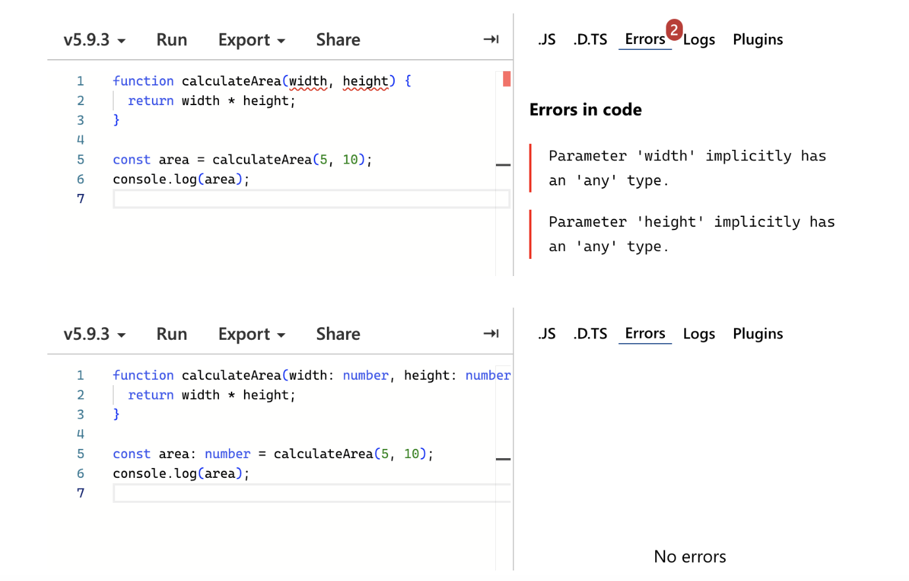

## Intro To TypeScript

Before using TypeScript, my experience with programming languages dealt mainly with dynamically typed environments, where flexibility and speed were focused on over structure. 
Entering the JavaScript module, I was unsure whether adding static typing to JavaScript would feel like an improvement or an unnecessarily complex aspect to it. 
After learning the basics, however, you’ll see how TypeScript pushes programmers to apply better software engineering habits, especially when paired with practice-based learning.

At first, TypeScript seems fairly similar to JavaScript. A lot of the syntax is translated pretty well, especially with features such as arrow functions, classes, and modules. 
This familiarity reduces the training curve for developers who already know JavaScript. However, TypeScript is different because of its type system. When using explicit types, interfaces, and access modifiers, it forces programmers to think more carefully about their data and program design before executing. 
Although it might seem restrictive at first, it leads to code clarity and fewer surprises at runtime.

## Getting The Hang Of It

Compared to other programming languages, TypeScript takes an interesting middle ground. It doesn’t have the same rigidness as Java or C++, but it provides a safer training environment than JavaScript. 
During development, the compiler acts as an early warning system that catches any mismatched types, missing properties, etc. This “early feedback” transformed how I approach writing code: instead of debugging after failure, I began thinking about my correctness and structure. 
Because of this, TypeScript encourages good habits that will be beneficial for small scripts to large collaborative projects.

From the perspective of software development, TypeScript is a strong language choice. Its focus on type safety improves the maintainability and readability of large programs where understanding its intention matters just as much as its functionality. 
Interfaces and types act as documentation that the compiler can validate, decreasing the dependence on comments that could become obsolete. While TypeScript can seem like it slows down development due to stricter requirements, the long-term benefits are fewer bugs, clearer contracts between components, and better collaboration. 
Such pros outweigh the friction.

## Reps and Sets

The idea of athletic software engineering, implemented through practice WODs, transforms my experience with programming. The WODs introduced time pressure and repetition, pushing me to recall syntax and concepts quickly rather than relying on extended reference checks. 
Initially, it was stressful when it came to falling short of the requirements. But at the same time, the timed exercises exposed gaps in my knowledge that I would have never noticed if in a more relaxed environment. However, in the long run, this stress became enlightening because through repetition, I began to build confidence, and finding patterns also began to feel more natural. 

This style of learning is different from the traditional lecture-based form in that it prioritizes performance under constraint. Though it can be uncomfortable, it mirrors real-world software engineering scenarios where developers are required to make quick decisions, debug efficiently, and come up with solutions despite being given incomplete information. 
The WODs format transformed abstract concepts into habits, not only by making a foundation from the purpose of TypeScript, but also by explaining how and when to use it effectively.

## Therefore...

In conclusion, the basics of TypeScript changed how I view both TypeScript and the process of learning technical skills. TypeScript is different from other languages because it has long-term software engineering quality in mind. 
It balances flexibility with discipline. Athletic software engineering, while challenging, is an effective way to refine these ideas through practice rather than passive exposure. Though it can be stressful at times, this approach makes learning more engaging and impactful, and I believe this method will work well for me as a software engineer.

